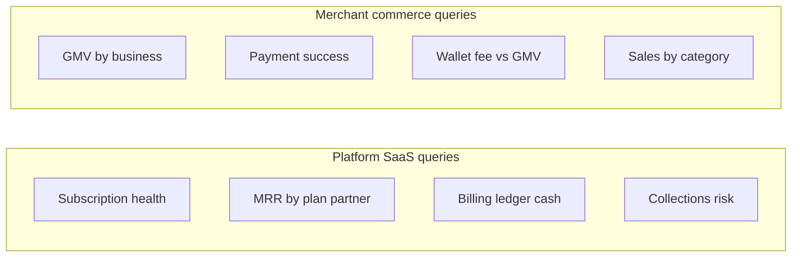

# DirectPay Report Builder SQL (no seeding)

## Deliverable

Paste-ready SQL only (**14 reports**). Connect the DirectPay Postgres DB as a biReports data source, then paste each query into the Report Builder / query editor. No seeds, no reporting views, no app code changes.

**Catalog:** 1–4 SaaS · 5–8 Commerce · 9–14 Merchant health (dependable, concentration, at-risk, dormant, activation, industry).

## Conventions (all queries)

- **Identifiers:** Prisma tables/columns are camelCase — always quote: `"Payment"`, `"businessId"`.
- **Dates:** half-open range with biReports vars `:dateFrom` and `:dateToExclusive` (auto-expanded from `dateTo` + 1 day). Prefer `timestamp` casts so indexes on `"createdAt"` / `"completedAt"` / `"paidAt"` / `"succeededAt"` can be used.
- **Optional tenant filter:** wrap with `[[ ... :businessId? ... ]]` so the block drops when unset.
- **Latest subscription:** `DISTINCT ON ("businessId") ... ORDER BY "businessId", "createdAt" DESC` (matches DirectPay app semantics).
- **Partner channel:** `partnerApp` is not stored; derive from `platformBillingWaived` + `partnerProvisioningExternalUserId` (`analytics-bi` | `waived-partner` | `self-serve`).
- **Do not mix** platform billing tables with merchant payment tables in one report.



---

## 1. `[DP SaaS] - Subscription health — period comparison`

**Purpose:** Latest-subscription status mix; new starts / cancellations / expiries in current vs previous equal-length window.

**Indexes used:** `"Subscription"("businessId", status)`; event filters on `"createdAt"` / `"cancelledAt"` / `"endedAt"`.

```sql
WITH period_bounds AS (
  SELECT
    CAST(:dateFrom AS timestamp) AS period_start,
    CAST(:dateToExclusive AS timestamp) AS period_end,
    (
      CAST(:dateFrom AS timestamp)
      - (CAST(:dateToExclusive AS timestamp) - CAST(:dateFrom AS timestamp))
    ) AS previous_period_start,
    CAST(:dateFrom AS timestamp) AS previous_period_end
),
latest_sub AS (
  SELECT DISTINCT ON (s."businessId")
    s."businessId",
    s.status,
    p.code AS plan_code
  FROM "Subscription" s
  INNER JOIN "Plan" p ON p.id = s."planId"
  ORDER BY s."businessId", s."createdAt" DESC
),
status_snapshot AS (
  SELECT
    ls.status::text AS status,
    ls.plan_code::text AS plan_code,
    COUNT(*)::bigint AS business_count
  FROM latest_sub ls
  WHERE 1 = 1
  [[ AND ls."businessId" = :businessId? ]]
  GROUP BY ls.status, ls.plan_code
),
tagged_events AS (
  SELECT 'started'::text AS event_type, s."createdAt" AS event_at
  FROM "Subscription" s
  CROSS JOIN period_bounds pb
  WHERE s."createdAt" >= pb.previous_period_start
    AND s."createdAt" < pb.period_end
  [[ AND s."businessId" = :businessId? ]]

  UNION ALL

  SELECT 'cancelled', s."cancelledAt"
  FROM "Subscription" s
  CROSS JOIN period_bounds pb
  WHERE s."cancelledAt" IS NOT NULL
    AND s."cancelledAt" >= pb.previous_period_start
    AND s."cancelledAt" < pb.period_end
  [[ AND s."businessId" = :businessId? ]]

  UNION ALL

  SELECT 'ended', s."endedAt"
  FROM "Subscription" s
  CROSS JOIN period_bounds pb
  WHERE s."endedAt" IS NOT NULL
    AND s."endedAt" >= pb.previous_period_start
    AND s."endedAt" < pb.period_end
  [[ AND s."businessId" = :businessId? ]]
),
events AS (
  SELECT
    te.event_type,
    CASE
      WHEN te.event_at >= pb.period_start AND te.event_at < pb.period_end THEN 'current'
      ELSE 'previous'
    END AS period_bucket,
    COUNT(*)::bigint AS event_count
  FROM tagged_events te
  CROSS JOIN period_bounds pb
  GROUP BY 1, 2
)
SELECT
  'snapshot'::text AS section,
  ss.status AS dimension,
  ss.plan_code,
  ss.business_count AS metric_value,
  NULL::text AS period_bucket,
  NULL::text AS event_type
FROM status_snapshot ss
UNION ALL
SELECT
  'events',
  NULL,
  NULL,
  e.event_count,
  e.period_bucket,
  e.event_type
FROM events e
ORDER BY 1, 3 NULLS LAST, 2 NULLS LAST, 5, 6;
```

---

## 2. `[DP SaaS] - MRR by plan and partner`

**Purpose:** Normalized monthly recurring revenue from latest billable subscriptions (ACTIVE / TRIALING / PAST_DUE). Corporate template price when assigned; else catalog plan monthly/yearly.

```sql
WITH latest_sub AS (
  SELECT DISTINCT ON (s."businessId")
    s."businessId",
    s.status,
    s."billingInterval",
    s."contractPerpetual",
    p.code AS plan_code,
    p.name AS plan_name,
    p."monthlyPrice" AS catalog_monthly,
    p."yearlyPrice" AS catalog_yearly,
    p.currency AS catalog_currency
  FROM "Subscription" s
  INNER JOIN "Plan" p ON p.id = s."planId"
  WHERE s.status IN ('TRIALING', 'ACTIVE', 'PAST_DUE')
  ORDER BY s."businessId", s."createdAt" DESC
),
priced AS (
  SELECT
    ls."businessId",
    ls.status::text AS status,
    ls.plan_code::text AS plan_code,
    ls.plan_name,
    ls."billingInterval"::text AS billing_interval,
    CASE
      WHEN b."partnerProvisioningExternalUserId" IS NOT NULL
        AND b."platformBillingWaived" = false THEN 'analytics-bi'
      WHEN b."partnerProvisioningExternalUserId" IS NOT NULL
        AND b."platformBillingWaived" = true THEN 'waived-partner'
      ELSE 'self-serve'
    END AS partner_channel,
    b."platformBillingWaived",
    COALESCE(cp.currency, ls.catalog_currency) AS currency,
    CASE
      WHEN b."platformBillingWaived" THEN 0::numeric
      WHEN ls."contractPerpetual"
        OR ls."billingInterval" = 'CONTRACT_INFINITE' THEN 0::numeric
      WHEN cp.id IS NOT NULL THEN
        CASE ls."billingInterval"
          WHEN 'MONTHLY' THEN cp."monthlyPrice"
          WHEN 'QUARTERLY' THEN cp."quarterlyPrice"
          WHEN 'HALF_YEARLY' THEN cp."halfYearlyPrice"
          WHEN 'YEARLY' THEN cp."yearlyPrice"
          WHEN 'TWO_YEARS' THEN cp."twoYearPrice"
          ELSE cp."monthlyPrice"
        END
      WHEN ls."billingInterval" = 'YEARLY' THEN ls.catalog_yearly
      ELSE ls.catalog_monthly
    END AS period_amount
  FROM latest_sub ls
  INNER JOIN "Business" b ON b.id = ls."businessId"
  LEFT JOIN "CorporateBillingPlan" cp ON cp.id = b."corporateBillingPlanId"
  WHERE 1 = 1
  [[ AND ls."businessId" = :businessId? ]]
),
normalized AS (
  SELECT
    p.*,
    CASE p.billing_interval
      WHEN 'MONTHLY' THEN p.period_amount
      WHEN 'QUARTERLY' THEN ROUND(p.period_amount / 3, 2)
      WHEN 'HALF_YEARLY' THEN ROUND(p.period_amount / 6, 2)
      WHEN 'YEARLY' THEN ROUND(p.period_amount / 12, 2)
      WHEN 'TWO_YEARS' THEN ROUND(p.period_amount / 24, 2)
      ELSE 0::numeric
    END AS mrr_amount
  FROM priced p
)
SELECT
  partner_channel,
  plan_code,
  plan_name,
  billing_interval,
  status,
  currency,
  COUNT(*)::bigint AS subscription_count,
  SUM(period_amount)::numeric AS period_amount_sum,
  SUM(mrr_amount)::numeric AS mrr_sum
FROM normalized
GROUP BY partner_channel, plan_code, plan_name, billing_interval, status, currency
ORDER BY mrr_sum DESC, partner_channel, plan_code;
```

---

## 3. `[DP SaaS] - Billing ledger cash & wallet fees`

**Purpose:** Succeeded platform cash in/out and wallet fees in the selected window (single scan of `"BillingLedgerEntry"`).

**Indexes used:** `"BillingLedgerEntry"("businessId", "createdAt")`; filter also on `"succeededAt"` for accuracy of cash timing.

```sql
WITH period_bounds AS (
  SELECT
    CAST(:dateFrom AS timestamp) AS period_start,
    CAST(:dateToExclusive AS timestamp) AS period_end
),
ledger AS (
  SELECT
    ble.type::text AS entry_type,
    ble.direction::text AS direction,
    ble.currency,
    ble.provider,
    ble.amount::numeric AS amount,
    ble."succeededAt"
  FROM "BillingLedgerEntry" ble
  CROSS JOIN period_bounds pb
  WHERE ble.status = 'SUCCEEDED'
    AND ble."succeededAt" IS NOT NULL
    AND ble."succeededAt" >= pb.period_start
    AND ble."succeededAt" < pb.period_end
  [[ AND ble."businessId" = :businessId? ]]
)
SELECT
  entry_type,
  direction,
  currency,
  provider,
  COUNT(*)::bigint AS entry_count,
  SUM(amount)::numeric AS amount_sum,
  SUM(
    CASE
      WHEN direction = 'MONEY_IN' THEN amount
      WHEN direction = 'MONEY_OUT' THEN -amount
      ELSE 0
    END
  )::numeric AS signed_net
FROM ledger
GROUP BY entry_type, direction, currency, provider
ORDER BY entry_type, provider;
```

---

## 4. `[DP SaaS] - Collections & refund risk`

**Purpose:** Pending / failed invoices + manual refund review queue (point-in-time; date filter applies to invoice `dueDate` / `createdAt` for aging context).

```sql
WITH period_bounds AS (
  SELECT
    CAST(:dateFrom AS timestamp) AS period_start,
    CAST(:dateToExclusive AS timestamp) AS period_end
),
open_invoices AS (
  SELECT
    si.id,
    si."businessId",
    b.name AS business_name,
    si.status::text AS invoice_status,
    si.amount::numeric AS amount,
    si.currency,
    si."dueDate",
    si."createdAt",
    si."manualRefundReviewStatus"::text AS refund_review_status,
    GREATEST(
      0,
      EXTRACT(DAY FROM (CURRENT_TIMESTAMP - si."dueDate"))
    )::int AS days_past_due
  FROM "SubscriptionInvoice" si
  INNER JOIN "Business" b ON b.id = si."businessId"
  CROSS JOIN period_bounds pb
  WHERE si.status IN ('PENDING', 'FAILED')
    AND si."createdAt" < pb.period_end
  [[ AND si."businessId" = :businessId? ]]
),
refund_queue AS (
  SELECT
    si.id,
    si."businessId",
    b.name AS business_name,
    si.status::text AS invoice_status,
    si.amount::numeric AS amount,
    si.currency,
    si."dueDate",
    si."createdAt",
    si."manualRefundReviewStatus"::text AS refund_review_status,
    NULL::int AS days_past_due
  FROM "SubscriptionInvoice" si
  INNER JOIN "Business" b ON b.id = si."businessId"
  WHERE si."manualRefundReviewStatus" IN (
    'PENDING_REVIEW',
    'APPROVED_FOR_REFUND'
  )
  [[ AND si."businessId" = :businessId? ]]
)
SELECT
  'open_invoice'::text AS section,
  oi.business_name,
  oi."businessId",
  oi.invoice_status,
  oi.refund_review_status,
  oi.currency,
  oi.amount,
  oi."dueDate",
  oi.days_past_due
FROM open_invoices oi

UNION ALL

SELECT
  'refund_review',
  rq.business_name,
  rq."businessId",
  rq.invoice_status,
  rq.refund_review_status,
  rq.currency,
  rq.amount,
  rq."dueDate",
  rq.days_past_due
FROM refund_queue rq

ORDER BY section, days_past_due DESC NULLS LAST, "dueDate";
```

---

## 5. `[DP Commerce] - GMV by business — period comparison`

**Purpose:** Completed payment volume current vs previous window in **one pass**.

**Indexes used:** `"Payment"("businessId", status)`; time filter on `"completedAt"` (fallback `"createdAt"` only when needed — prefer completedAt for COMPLETED).

```sql
WITH period_bounds AS (
  SELECT
    CAST(:dateFrom AS timestamp) AS period_start,
    CAST(:dateToExclusive AS timestamp) AS period_end,
    (
      CAST(:dateFrom AS timestamp)
      - (CAST(:dateToExclusive AS timestamp) - CAST(:dateFrom AS timestamp))
    ) AS previous_period_start,
    CAST(:dateFrom AS timestamp) AS previous_period_end
),
payments_in_window AS (
  SELECT
    p."businessId",
    p.amount::numeric AS amount,
    p.currency,
    CASE
      WHEN p."completedAt" >= pb.period_start
        AND p."completedAt" < pb.period_end THEN 'current'
      ELSE 'previous'
    END AS period_bucket
  FROM "Payment" p
  CROSS JOIN period_bounds pb
  WHERE p.status = 'COMPLETED'
    AND p."completedAt" IS NOT NULL
    AND p."completedAt" >= pb.previous_period_start
    AND p."completedAt" < pb.period_end
  [[ AND p."businessId" = :businessId? ]]
),
rolled AS (
  SELECT
    w."businessId",
    w.currency,
    SUM(CASE WHEN w.period_bucket = 'current' THEN w.amount ELSE 0 END)::numeric AS current_gmv,
    SUM(CASE WHEN w.period_bucket = 'previous' THEN w.amount ELSE 0 END)::numeric AS previous_gmv,
    COUNT(*) FILTER (WHERE w.period_bucket = 'current')::bigint AS current_txn_count,
    COUNT(*) FILTER (WHERE w.period_bucket = 'previous')::bigint AS previous_txn_count
  FROM payments_in_window w
  GROUP BY w."businessId", w.currency
)
SELECT
  b.name AS business_name,
  b.industry,
  r."businessId",
  r.currency,
  r.previous_gmv,
  r.current_gmv,
  (r.current_gmv - r.previous_gmv)::numeric AS gmv_change,
  r.previous_txn_count,
  r.current_txn_count
FROM rolled r
INNER JOIN "Business" b ON b.id = r."businessId"
ORDER BY r.current_gmv DESC, b.name;
```

---

## 6. `[DP Commerce] - Payment success by provider`

**Purpose:** Attempt volume, completion rate, and GMV by method/provider/gateway in the period (single scan).

```sql
WITH period_bounds AS (
  SELECT
    CAST(:dateFrom AS timestamp) AS period_start,
    CAST(:dateToExclusive AS timestamp) AS period_end
)
SELECT
  p.method::text AS payment_method,
  p.provider::text AS provider,
  COALESCE(p."gatewayCode", '(none)') AS gateway_code,
  p.currency,
  COUNT(*)::bigint AS attempt_count,
  COUNT(*) FILTER (WHERE p.status = 'COMPLETED')::bigint AS completed_count,
  COUNT(*) FILTER (WHERE p.status = 'FAILED')::bigint AS failed_count,
  COUNT(*) FILTER (WHERE p.status = 'CANCELLED')::bigint AS cancelled_count,
  COUNT(*) FILTER (WHERE p.status = 'PENDING')::bigint AS pending_count,
  ROUND(
    100.0 * COUNT(*) FILTER (WHERE p.status = 'COMPLETED') / NULLIF(COUNT(*), 0),
    2
  ) AS success_rate_pct,
  COALESCE(
    SUM(p.amount::numeric) FILTER (WHERE p.status = 'COMPLETED'),
    0
  )::numeric AS completed_gmv
FROM "Payment" p
CROSS JOIN period_bounds pb
WHERE p."createdAt" >= pb.period_start
  AND p."createdAt" < pb.period_end
[[ AND p."businessId" = :businessId? ]]
GROUP BY p.method, p.provider, COALESCE(p."gatewayCode", '(none)'), p.currency
ORDER BY completed_gmv DESC, attempt_count DESC;
```

---

## 7. `[DP Commerce] - Wallet fee vs GMV`

**Purpose:** Customer sale GMV vs estimated wallet fees from `"SalesLedgerEntry"` (succeeded only), fee rate by business/provider.

**Indexes used:** `"SalesLedgerEntry"("businessId", "createdAt")`.

```sql
WITH period_bounds AS (
  SELECT
    CAST(:dateFrom AS timestamp) AS period_start,
    CAST(:dateToExclusive AS timestamp) AS period_end
),
ledger AS (
  SELECT
    sle."businessId",
    sle.type::text AS entry_type,
    sle.provider,
    sle.currency,
    sle.amount::numeric AS amount
  FROM "SalesLedgerEntry" sle
  CROSS JOIN period_bounds pb
  WHERE sle.status = 'SUCCEEDED'
    AND sle."succeededAt" >= pb.period_start
    AND sle."succeededAt" < pb.period_end
  [[ AND sle."businessId" = :businessId? ]]
)
SELECT
  b.name AS business_name,
  l."businessId",
  l.provider,
  l.currency,
  COALESCE(SUM(l.amount) FILTER (WHERE l.entry_type = 'CUSTOMER_SALE'), 0)::numeric AS sale_gmv,
  COALESCE(SUM(l.amount) FILTER (WHERE l.entry_type = 'WALLET_FEE'), 0)::numeric AS wallet_fee,
  ROUND(
    100.0 * COALESCE(SUM(l.amount) FILTER (WHERE l.entry_type = 'WALLET_FEE'), 0)
      / NULLIF(SUM(l.amount) FILTER (WHERE l.entry_type = 'CUSTOMER_SALE'), 0),
    4
  ) AS fee_rate_pct
FROM ledger l
INNER JOIN "Business" b ON b.id = l."businessId"
GROUP BY b.name, l."businessId", l.provider, l.currency
ORDER BY sale_gmv DESC;
```

---

## 8. `[DP Commerce] - Sales by category`

**Purpose:** Paid order line totals by product category / menu category (join only paid orders in range).

**Indexes used:** `"Order"("businessId", "createdAt")` + status; `"OrderLine"("orderId")`.

```sql
WITH period_bounds AS (
  SELECT
    CAST(:dateFrom AS timestamp) AS period_start,
    CAST(:dateToExclusive AS timestamp) AS period_end
),
paid_orders AS (
  SELECT o.id, o."businessId", o.currency
  FROM "Order" o
  CROSS JOIN period_bounds pb
  WHERE o.status = 'PAID'
    AND o."createdAt" >= pb.period_start
    AND o."createdAt" < pb.period_end
  [[ AND o."businessId" = :businessId? ]]
)
SELECT
  b.name AS business_name,
  po."businessId",
  po.currency,
  COALESCE(mc.name, NULLIF(TRIM(pr.category), ''), '(uncategorized)') AS category_name,
  COUNT(DISTINCT po.id)::bigint AS order_count,
  SUM(ol.quantity)::numeric AS units_sold,
  SUM(ol."lineTotal")::numeric AS line_gmv
FROM paid_orders po
INNER JOIN "Business" b ON b.id = po."businessId"
INNER JOIN "OrderLine" ol ON ol."orderId" = po.id
INNER JOIN "Product" pr ON pr.id = ol."productId"
LEFT JOIN "MenuCategory" mc ON mc.id = pr."menuCategoryId"
GROUP BY b.name, po."businessId", po.currency,
  COALESCE(mc.name, NULLIF(TRIM(pr.category), ''), '(uncategorized)')
ORDER BY line_gmv DESC, category_name;
```

---

## Additional merchant reports (9–14)

These answer “who are our best / riskiest merchants?” for platform ops. Dependability = **volume + success rate + active days + healthy subscription** — not a stored score; computed in SQL.

---

## 9. `[DP Merchants] - Dependable merchants scorecard`

**Purpose:** Rank merchants by a dependability score in the selected window. Defaults: require ≥1 completed payment; sort by score then GMV.

**Score (0–100, transparent weights):**
- GMV percentile within period (40)
- Payment success rate (30)
- Active calendar days / days in period (20)
- Latest subscription in TRIALING/ACTIVE (10), else 0 if PAST_DUE/other

```sql
WITH period_bounds AS (
  SELECT
    CAST(:dateFrom AS timestamp) AS period_start,
    CAST(:dateToExclusive AS timestamp) AS period_end,
    GREATEST(
      1,
      (CAST(:dateToExclusive AS date) - CAST(:dateFrom AS date))
    ) AS period_days
),
latest_sub AS (
  SELECT DISTINCT ON (s."businessId")
    s."businessId",
    s.status::text AS subscription_status,
    p.code::text AS plan_code
  FROM "Subscription" s
  INNER JOIN "Plan" p ON p.id = s."planId"
  ORDER BY s."businessId", s."createdAt" DESC
),
pay_agg AS (
  SELECT
    p."businessId",
    p.currency,
    COUNT(*)::bigint AS attempt_count,
    COUNT(*) FILTER (WHERE p.status = 'COMPLETED')::bigint AS completed_count,
    COALESCE(
      SUM(p.amount::numeric) FILTER (WHERE p.status = 'COMPLETED'),
      0
    ) AS gmv,
    COUNT(DISTINCT (p."completedAt"::date))
      FILTER (WHERE p.status = 'COMPLETED' AND p."completedAt" IS NOT NULL)::bigint AS active_days
  FROM "Payment" p
  CROSS JOIN period_bounds pb
  WHERE p."createdAt" >= pb.period_start
    AND p."createdAt" < pb.period_end
  [[ AND p."businessId" = :businessId? ]]
  GROUP BY p."businessId", p.currency
),
scored AS (
  SELECT
    pa.*,
    ls.subscription_status,
    ls.plan_code,
    ROUND(
      100.0 * pa.completed_count / NULLIF(pa.attempt_count, 0),
      2
    ) AS success_rate_pct,
    ROUND(
      100.0 * pa.active_days / NULLIF(pb.period_days, 0),
      2
    ) AS active_day_pct,
    PERCENT_RANK() OVER (
      PARTITION BY pa.currency
      ORDER BY pa.gmv
    ) AS gmv_percentile,
    CASE
      WHEN ls.subscription_status IN ('TRIALING', 'ACTIVE') THEN 10
      ELSE 0
    END AS sub_score
  FROM pay_agg pa
  CROSS JOIN period_bounds pb
  LEFT JOIN latest_sub ls ON ls."businessId" = pa."businessId"
  WHERE pa.completed_count > 0
)
SELECT
  b.name AS business_name,
  b.industry,
  b."ownerEmail",
  s."businessId",
  s.currency,
  s.plan_code,
  s.subscription_status,
  s.gmv,
  s.attempt_count,
  s.completed_count,
  s.success_rate_pct,
  s.active_days,
  s.active_day_pct,
  ROUND(
    (40 * s.gmv_percentile)
    + (30 * LEAST(s.success_rate_pct, 100) / 100.0)
    + (20 * LEAST(s.active_day_pct, 100) / 100.0)
    + s.sub_score,
    2
  ) AS dependability_score
FROM scored s
INNER JOIN "Business" b ON b.id = s."businessId"
ORDER BY dependability_score DESC, s.gmv DESC
LIMIT 100;
```

---

## 10. `[DP Merchants] - GMV concentration (top N)`

**Purpose:** How much total GMV sits in the top merchants (platform risk / dependency on a few tenants).

```sql
WITH period_bounds AS (
  SELECT
    CAST(:dateFrom AS timestamp) AS period_start,
    CAST(:dateToExclusive AS timestamp) AS period_end
),
by_biz AS (
  SELECT
    p."businessId",
    p.currency,
    SUM(p.amount::numeric)::numeric AS gmv
  FROM "Payment" p
  CROSS JOIN period_bounds pb
  WHERE p.status = 'COMPLETED'
    AND p."completedAt" IS NOT NULL
    AND p."completedAt" >= pb.period_start
    AND p."completedAt" < pb.period_end
  [[ AND p."businessId" = :businessId? ]]
  GROUP BY p."businessId", p.currency
),
ranked AS (
  SELECT
    bb.*,
    SUM(bb.gmv) OVER (PARTITION BY bb.currency) AS total_gmv,
    ROW_NUMBER() OVER (
      PARTITION BY bb.currency
      ORDER BY bb.gmv DESC
    ) AS gmv_rank,
    SUM(bb.gmv) OVER (
      PARTITION BY bb.currency
      ORDER BY bb.gmv DESC
      ROWS BETWEEN UNBOUNDED PRECEDING AND CURRENT ROW
    ) AS cumulative_gmv
  FROM by_biz bb
)
SELECT
  b.name AS business_name,
  b.industry,
  r."businessId",
  r.currency,
  r.gmv_rank,
  r.gmv,
  r.total_gmv,
  ROUND(100.0 * r.gmv / NULLIF(r.total_gmv, 0), 2) AS gmv_share_pct,
  ROUND(100.0 * r.cumulative_gmv / NULLIF(r.total_gmv, 0), 2) AS cumulative_share_pct
FROM ranked r
INNER JOIN "Business" b ON b.id = r."businessId"
WHERE r.gmv_rank <= 25
ORDER BY r.currency, r.gmv_rank;
```

---

## 11. `[DP Merchants] - At-risk / declining merchants`

**Purpose:** Merchants whose current-period GMV fell vs previous equal window, and/or success rate dropped, and/or subscription is PAST_DUE.

```sql
WITH period_bounds AS (
  SELECT
    CAST(:dateFrom AS timestamp) AS period_start,
    CAST(:dateToExclusive AS timestamp) AS period_end,
    (
      CAST(:dateFrom AS timestamp)
      - (CAST(:dateToExclusive AS timestamp) - CAST(:dateFrom AS timestamp))
    ) AS previous_period_start,
    CAST(:dateFrom AS timestamp) AS previous_period_end
),
latest_sub AS (
  SELECT DISTINCT ON (s."businessId")
    s."businessId",
    s.status::text AS subscription_status
  FROM "Subscription" s
  ORDER BY s."businessId", s."createdAt" DESC
),
pay_windows AS (
  SELECT
    p."businessId",
    p.currency,
    CASE
      WHEN p."completedAt" >= pb.period_start
        AND p."completedAt" < pb.period_end THEN 'current'
      ELSE 'previous'
    END AS period_bucket,
    p.status::text AS payment_status,
    p.amount::numeric AS amount,
    p."createdAt"
  FROM "Payment" p
  CROSS JOIN period_bounds pb
  WHERE (
      (
        p.status = 'COMPLETED'
        AND p."completedAt" IS NOT NULL
        AND p."completedAt" >= pb.previous_period_start
        AND p."completedAt" < pb.period_end
      )
      OR (
        p."createdAt" >= pb.previous_period_start
        AND p."createdAt" < pb.period_end
      )
    )
  [[ AND p."businessId" = :businessId? ]]
),
agg AS (
  SELECT
    pw."businessId",
    pw.currency,
    COALESCE(SUM(pw.amount) FILTER (
      WHERE pw.period_bucket = 'current' AND pw.payment_status = 'COMPLETED'
    ), 0)::numeric AS current_gmv,
    COALESCE(SUM(pw.amount) FILTER (
      WHERE pw.period_bucket = 'previous' AND pw.payment_status = 'COMPLETED'
    ), 0)::numeric AS previous_gmv,
    COUNT(*) FILTER (
      WHERE pw."createdAt" >= (SELECT period_start FROM period_bounds)
        AND pw."createdAt" < (SELECT period_end FROM period_bounds)
    )::bigint AS current_attempts,
    COUNT(*) FILTER (
      WHERE pw."createdAt" >= (SELECT period_start FROM period_bounds)
        AND pw."createdAt" < (SELECT period_end FROM period_bounds)
        AND pw.payment_status = 'COMPLETED'
    )::bigint AS current_completed,
    COUNT(*) FILTER (
      WHERE pw."createdAt" >= (SELECT previous_period_start FROM period_bounds)
        AND pw."createdAt" < (SELECT previous_period_end FROM period_bounds)
    )::bigint AS previous_attempts,
    COUNT(*) FILTER (
      WHERE pw."createdAt" >= (SELECT previous_period_start FROM period_bounds)
        AND pw."createdAt" < (SELECT previous_period_end FROM period_bounds)
        AND pw.payment_status = 'COMPLETED'
    )::bigint AS previous_completed
  FROM pay_windows pw
  GROUP BY pw."businessId", pw.currency
),
metrics AS (
  SELECT
    a.*,
    ROUND(100.0 * a.current_completed / NULLIF(a.current_attempts, 0), 2) AS current_success_pct,
    ROUND(100.0 * a.previous_completed / NULLIF(a.previous_attempts, 0), 2) AS previous_success_pct,
    (a.current_gmv - a.previous_gmv)::numeric AS gmv_change,
    ROUND(
      100.0 * (a.current_gmv - a.previous_gmv) / NULLIF(a.previous_gmv, 0),
      2
    ) AS gmv_change_pct,
    ls.subscription_status
  FROM agg a
  LEFT JOIN latest_sub ls ON ls."businessId" = a."businessId"
)
SELECT
  b.name AS business_name,
  b.industry,
  m."businessId",
  m.currency,
  m.subscription_status,
  m.previous_gmv,
  m.current_gmv,
  m.gmv_change,
  m.gmv_change_pct,
  m.previous_success_pct,
  m.current_success_pct,
  CASE
    WHEN m.subscription_status = 'PAST_DUE' THEN 'past_due'
    WHEN m.previous_gmv > 0 AND m.current_gmv < m.previous_gmv * 0.7 THEN 'gmv_drop_30pct'
    WHEN m.previous_success_pct IS NOT NULL
      AND m.current_success_pct IS NOT NULL
      AND m.current_success_pct < m.previous_success_pct - 10 THEN 'success_drop'
    WHEN m.previous_gmv > 0 AND m.current_gmv = 0 THEN 'went_silent'
    ELSE 'watch'
  END AS risk_flag
FROM metrics m
INNER JOIN "Business" b ON b.id = m."businessId"
WHERE m.previous_gmv > 0
  AND (
    m.subscription_status = 'PAST_DUE'
    OR m.current_gmv < m.previous_gmv * 0.7
    OR (
      m.previous_success_pct IS NOT NULL
      AND m.current_success_pct IS NOT NULL
      AND m.current_success_pct < m.previous_success_pct - 10
    )
  )
ORDER BY m.gmv_change ASC, m.previous_gmv DESC;
```

---

## 12. `[DP Merchants] - Dormant but subscribed`

**Purpose:** ACTIVE/TRIALING/PAST_DUE subscribers with **no** completed payment in the selected window (paying for the platform but not using commerce — or waived partners idle).

```sql
WITH period_bounds AS (
  SELECT
    CAST(:dateFrom AS timestamp) AS period_start,
    CAST(:dateToExclusive AS timestamp) AS period_end
),
latest_sub AS (
  SELECT DISTINCT ON (s."businessId")
    s."businessId",
    s.status::text AS subscription_status,
    s."currentPeriodEnd",
    p.code::text AS plan_code
  FROM "Subscription" s
  INNER JOIN "Plan" p ON p.id = s."planId"
  WHERE s.status IN ('TRIALING', 'ACTIVE', 'PAST_DUE')
  ORDER BY s."businessId", s."createdAt" DESC
),
active_payers AS (
  SELECT DISTINCT p."businessId"
  FROM "Payment" p
  CROSS JOIN period_bounds pb
  WHERE p.status = 'COMPLETED'
    AND p."completedAt" IS NOT NULL
    AND p."completedAt" >= pb.period_start
    AND p."completedAt" < pb.period_end
),
last_sale AS (
  SELECT
    p."businessId",
    MAX(p."completedAt") AS last_completed_at
  FROM "Payment" p
  WHERE p.status = 'COMPLETED'
    AND p."completedAt" IS NOT NULL
  GROUP BY p."businessId"
)
SELECT
  b.name AS business_name,
  b.industry,
  b."ownerEmail",
  ls."businessId",
  ls.plan_code,
  ls.subscription_status,
  ls."currentPeriodEnd",
  b."platformBillingWaived",
  CASE
    WHEN b."partnerProvisioningExternalUserId" IS NOT NULL
      AND b."platformBillingWaived" = false THEN 'analytics-bi'
    WHEN b."partnerProvisioningExternalUserId" IS NOT NULL
      AND b."platformBillingWaived" = true THEN 'waived-partner'
    ELSE 'self-serve'
  END AS partner_channel,
  last_sale.last_completed_at
FROM latest_sub ls
INNER JOIN "Business" b ON b.id = ls."businessId"
LEFT JOIN active_payers ap ON ap."businessId" = ls."businessId"
LEFT JOIN last_sale ON last_sale."businessId" = ls."businessId"
WHERE ap."businessId" IS NULL
[[ AND ls."businessId" = :businessId? ]]
ORDER BY ls.subscription_status, last_sale.last_completed_at NULLS FIRST, b.name;
```

---

## 13. `[DP Merchants] - Time to first paid sale`

**Purpose:** Activation lag from business creation (or subscription start) to first COMPLETED payment — find slow-to-activate merchants.

```sql
WITH first_payment AS (
  SELECT
    p."businessId",
    MIN(p."completedAt") AS first_completed_at
  FROM "Payment" p
  WHERE p.status = 'COMPLETED'
    AND p."completedAt" IS NOT NULL
  [[ AND p."businessId" = :businessId? ]]
  GROUP BY p."businessId"
),
latest_sub AS (
  SELECT DISTINCT ON (s."businessId")
    s."businessId",
    s."createdAt" AS subscription_started_at,
    s.status::text AS subscription_status,
    p.code::text AS plan_code
  FROM "Subscription" s
  INNER JOIN "Plan" p ON p.id = s."planId"
  ORDER BY s."businessId", s."createdAt" DESC
)
SELECT
  b.name AS business_name,
  b.industry,
  b.id AS "businessId",
  b."createdAt" AS business_created_at,
  ls.plan_code,
  ls.subscription_status,
  ls.subscription_started_at,
  fp.first_completed_at,
  CASE
    WHEN fp.first_completed_at IS NULL THEN NULL
    ELSE (fp.first_completed_at::date - b."createdAt"::date)
  END AS days_business_to_first_sale,
  CASE
    WHEN fp.first_completed_at IS NULL OR ls.subscription_started_at IS NULL THEN NULL
    ELSE (fp.first_completed_at::date - ls.subscription_started_at::date)
  END AS days_sub_to_first_sale,
  CASE
    WHEN fp.first_completed_at IS NULL THEN 'not_activated'
    WHEN (fp.first_completed_at::date - b."createdAt"::date) <= 7 THEN 'fast'
    WHEN (fp.first_completed_at::date - b."createdAt"::date) <= 30 THEN 'normal'
    ELSE 'slow'
  END AS activation_band
FROM "Business" b
LEFT JOIN first_payment fp ON fp."businessId" = b.id
LEFT JOIN latest_sub ls ON ls."businessId" = b.id
WHERE b."createdAt" >= CAST(:dateFrom AS timestamp)
  AND b."createdAt" < CAST(:dateToExclusive AS timestamp)
[[ AND b.id = :businessId? ]]
ORDER BY days_business_to_first_sale DESC NULLS FIRST, b."createdAt" DESC;
```

---

## 14. `[DP Merchants] - Industry leaderboard`

**Purpose:** Industry rollup of GMV, merchants, success rate — see which verticals are healthiest.

```sql
WITH period_bounds AS (
  SELECT
    CAST(:dateFrom AS timestamp) AS period_start,
    CAST(:dateToExclusive AS timestamp) AS period_end
),
pay AS (
  SELECT
    p."businessId",
    p.currency,
    p.status::text AS payment_status,
    p.amount::numeric AS amount
  FROM "Payment" p
  CROSS JOIN period_bounds pb
  WHERE p."createdAt" >= pb.period_start
    AND p."createdAt" < pb.period_end
  [[ AND p."businessId" = :businessId? ]]
)
SELECT
  COALESCE(NULLIF(TRIM(b.industry), ''), '(unknown)') AS industry,
  p.currency,
  COUNT(DISTINCT b.id)::bigint AS merchant_count,
  COUNT(*)::bigint AS attempt_count,
  COUNT(*) FILTER (WHERE p.payment_status = 'COMPLETED')::bigint AS completed_count,
  ROUND(
    100.0 * COUNT(*) FILTER (WHERE p.payment_status = 'COMPLETED')
      / NULLIF(COUNT(*), 0),
    2
  ) AS success_rate_pct,
  COALESCE(
    SUM(p.amount) FILTER (WHERE p.payment_status = 'COMPLETED'),
    0
  )::numeric AS gmv
FROM pay p
INNER JOIN "Business" b ON b.id = p."businessId"
GROUP BY COALESCE(NULLIF(TRIM(b.industry), ''), '(unknown)'), p.currency
ORDER BY gmv DESC, industry;
```

---

## Variables (Report Builder)

| Variable | Required | Notes |
|----------|----------|-------|
| `dateFrom` | Yes (except MRR snapshot) | Inclusive start |
| `dateTo` | Yes (except MRR) | Inclusive end; engine also sets `dateToExclusive` |
| `businessId?` | No | Optional tenant filter via `[[ ]]` blocks |

MRR query has **no date variables** (point-in-time snapshot). Collections uses `dateToExclusive` only to ignore invoices created after the end of the reporting window. Dependable merchants uses `LIMIT 100` — raise/remove in the editor if you want the full list.

## Optimization checklist baked into each query

- Predicate pushdown before joins; aggregate after filter
- Half-open timestamps (sargable; no `DATE(col)` wrapping)
- One payment/ledger scan for period comparisons (`FILTER` / `CASE`)
- `DISTINCT ON` only where latest-sub semantics require it
- Avoid `SELECT *`; project needed columns only
- Prefer `"completedAt"` / `"succeededAt"` for money recognition, `"createdAt"` for attempt metrics
- Window functions (`PERCENT_RANK`, running `SUM`) computed after per-business aggregation — not over raw payment rows

## Out of scope

- Seeding saved reports / publish scripts
- Creating `dp_rpt_*` DB views (queries run on raw tables)
- Syncing DirectPay data into biReports’ e-money warehouse
- Rebuilding GL / P&L interactive screens (stay in DirectPay)
- Tunable score weights as Report Builder parameters (weights are fixed in SQL; edit constants if needed)
