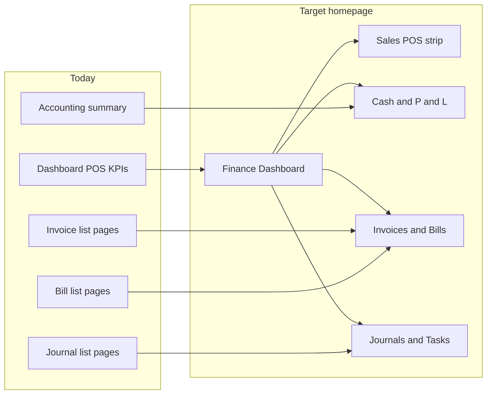

# Merchant finance dashboard (Xero-inspired)

## Research takeaway (Xero)

Xero’s homepage is not a static KPI strip. It answers **cash-flow and working-capital questions** with widgets that are both **insight** and **action**:

| Business question | Xero widget | DirectPay mapping |
|---|---|---|
| Are we making a profit? | Net profit / loss | Ledger P&L (`income`, `opex`, `netProfit`) from accounting summary |
| How much cash do we have? | Bank accounts | `cashPositions` / `cashTotal` |
| Can we afford bills? | Cash in & out (6 months) | Monthly `trend` income vs expenses |
| What is owed to us? | Invoices owed to you | Approved sales invoices (AR), overdue via `dueDate` |
| What do we owe? | Bills to pay | Approved supplier bills (AP), overdue via `dueDate` |
| Have we been paid? | Recent invoice payments | Recently `PAID` invoices / completed payments |
| What needs attention? | Tasks | Drafts, overdue AR/AP, awaiting-payment orders |
| Expenses | Expenses / bills | P&L operating expenses + unpaid bills (no separate expense-claims product) |

**Design principles to copy (not the purple Xero chrome):** curated multi-column widget grid, each widget answers one finance question, primary number + short breakdown + deep-link (“View all” / “Create”), period-aware where it matters. **Skip drag-and-drop / per-user layout persistence for v1**—ship a strong fixed layout that matches your existing QuickBooks-like UI (`PageCard`, `qb-*` tokens, Recharts).

## Current state

- [`webFrontend/src/screens/DashboardPage.tsx`](webFrontend/src/screens/DashboardPage.tsx) is a **POS/ops** view (7-day revenue, orders today, awaiting payment, recent orders) via `GET .../dashboard/summary`.
- Closest finance hub is [`AccountingPage.tsx`](webFrontend/src/screens/AccountingPage.tsx) (cash, net profit, 6-month trend, report tiles)—but it is buried under Accounting and does not surface invoices, bills, or journals as working-capital widgets.
- Invoice/bill models already have `status` + `dueDate` ([`schema.prisma`](backend/prisma/schema.prisma)); there is **no AR/AP aggregate endpoint** today.

## Approach

**Evolve merchant dashboard into the finance homepage.** Keep a compact **Sales** strip for POS businesses (existing 7-day revenue / orders). Add finance widgets beside/below it. Leave [`AccountingPage`](webFrontend/src/screens/AccountingPage.tsx) as the reports/navigation hub (avoid duplicating every report tile).

**One new backend aggregate** so the UI does not fan out five list APIs and roll up client-side.

### Backend

Extend or complement [`dashboard-summary.service.ts`](backend/src/services/dashboard-summary.service.ts) with a finance payload (prefer **one** `GET /api/businesses/:businessId/dashboard/summary` response that includes both POS + finance sections, so the page stays a single fetch):

- **cash**: reuse logic from [`accounting-summary.service.ts`](backend/src/services/accounting-summary.service.ts) (`cashTotal`, top cash positions).
- **pnl**: current period income, operating expenses, net profit (same signed-balance rules as accounting summary).
- **cashFlowTrend**: existing 6-month income/expense points (Xero “cash in and out” analogue on cash-basis ledger).
- **receivables**: count + total of `SalesInvoice` `APPROVED`; split overdue (`dueDate < today`) vs not yet due; 3–5 sample rows (code, contact, due, amount).
- **payables**: same for `Bill` `APPROVED`.
- **expenses**: `operatingExpenses` + unpaid bills total (label clearly as “Expenses this period” + “Bills to pay”).
- **journals**: count posted in last 7/30 days; 5 recent `JournalEntry` rows (memo, postedAt, sourceType) for a “Recent journals” widget.
- **tasks**: derived checklist items, e.g. draft invoices, draft bills, overdue AR, overdue AP, orders awaiting payment—each with count and deep-link path.
- **recentPaidInvoices**: last few `PAID` invoices (amount, paidAt, contact).

Wire in [`app.ts`](backend/src/app.ts) only if a new route is chosen; otherwise expand the existing dashboard route handler + Zod/types.

Permission: keep `dashboard.view`; gate finance widgets on the frontend with existing sales/accounting entitlements (`canAccess`) so cashiers without finance still see POS strip only.

### Frontend

Rebuild `MerchantDashboardPage` layout into a responsive widget grid:

1. **Header** — “Business overview” + short finance subtitle (drop industry-only POS copy as the sole message).
2. **Sales strip** (existing KPIs + optional mini 7-day chart) — retained for catalog/POS industries.
3. **Row: Cash | Net profit** — cash total + positions; income vs expenses / net with link to `/accounting/profit-loss`.
4. **Row: Cash in & out chart** — Recharts area/bar from 6-month trend (reuse pattern from AccountingPage).
5. **Row: Invoices owed | Bills to pay** — totals, overdue emphasis, sample list, CTAs to `/sales/invoices` and `/sales/bills` (+ “New” when permitted).
6. **Row: Tasks | Recent journals** — actionable tasks; journals link to `/accounting/transaction-journal` or general journal.
7. **Row: Recent payments / paid invoices** — optional if space; otherwise fold into invoices widget.

Extract small presentational pieces under e.g. `webFrontend/src/components/dashboard/` (`DashboardStatTile`, `DashboardWidget`, `ReceivablesWidget`, …) to keep `DashboardPage.tsx` readable. Reuse `formatMoney`, `PageCard`, Recharts, existing status badge patterns.

Update [`salesApi.ts`](webFrontend/src/services/salesApi.ts) `DashboardSummary` types to match the expanded payload.

### What we are intentionally not doing in v1

- Drag-and-drop / saved per-user layouts (Xero Customize).
- Bank feed reconciliation widgets (no bank-feed product yet)—cash positions from chart of accounts only.
- Separate “Expenses claims” product—expenses = ledger opex + supplier bills.
- Merging Accounting page into Dashboard.

## Success criteria

Opening `/dashboard` answers, without leaving the page: sales momentum, cash on hand, profitability, money owed in/out, expense pressure, recent journal activity, and what to do next (tasks)—with one-click paths into the existing detail screens.
