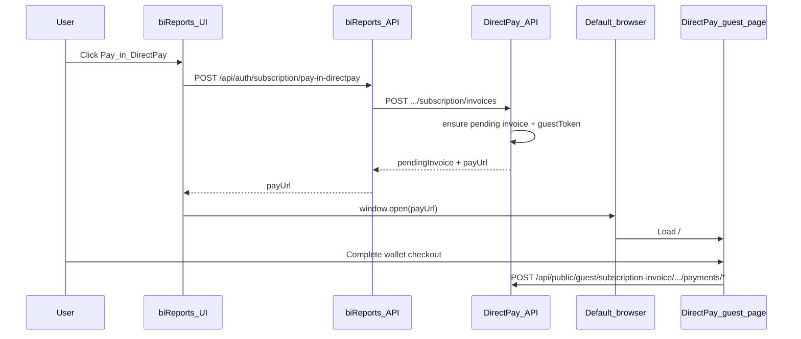

# Partner subscription payable invoice + biReports pay flow

## Context

DirectPay already supports **public guest payment** for platform subscription invoices at:

- **Frontend:** `/#/guest/subscription-invoice/:guestToken` (`[webFrontend/src/App.tsx](webFrontend/src/App.tsx)` uses HashRouter)
- **API:** `/api/public/guest/subscription-invoice/:guestToken/`* (`[backend/src/app.ts](backend/src/app.ts)`)

Partner subscription APIs today (`[backend/src/services/internal-partner-subscription.service.ts](backend/src/services/internal-partner-subscription.service.ts)`):


| Method | Path                                                           | Behavior                                           |
| ------ | -------------------------------------------------------------- | -------------------------------------------------- |
| `GET`  | `/api/internal-partner/v1/businesses/:businessId/subscription` | Read status + pending invoice                      |
| `POST` | `.../subscription`                                             | Start subscription (creates first pending invoice) |


Pending invoices are also created implicitly by `[ensureSubscriptionRenewalInvoiceForSubscription](backend/src/services/subscription-renewal-invoice.service.ts)` when `getBusinessSubscription` runs (renewal window, expired/cancelled reactivation). There is **no explicit partner POST** to request a payable invoice on demand.

**biReports** (`[/Users/mac/cody/Phantommetrics/biReports](file:///Users/mac/cody/Phantommetrics/biReports)`) already integrates as `partnerApp: analytics-bi` and shows **Pay in DirectPay** / **Renew in DirectPay** as static `<a href>` links. Two gaps:

1. No on-click call to ensure a fresh payable invoice exists before redirecting.
2. `[buildGuestInvoicePayUrl](file:///Users/mac/cody/Phantommetrics/biReports/backend/src/directpay/client.ts)` builds `.../guest/subscription-invoice/...` **without** the required `/#/` hash prefix (DirectPay emails use `[guestSubscriptionInvoiceUrl](backend/src/lib/public-guest-urls.ts)` which includes it).




---

## Part 1 — DirectPay: new partner endpoint

### New service function

Add `issueInternalPartnerSubscriptionPayableInvoice(businessId)` in `[backend/src/services/internal-partner-subscription.service.ts](backend/src/services/internal-partner-subscription.service.ts)`:

1. `assertInternalPartnerBusiness` (already done in route).
2. Snapshot whether a pending invoice exists **before** maintenance.
3. Call existing `getBusinessSubscription(businessId)` — this runs trial expiry + `ensureSubscriptionRenewalInvoiceForSubscription` (idempotent; reuses existing pending invoice when present).
4. Build response via `getInternalPartnerBusinessSubscription`.
5. If `pendingInvoice` is missing or has no `guestToken` → `409` with a clear message (e.g. no subscription, billing waived/comped, or not yet in a billable period).
6. Attach `payUrl` using `guestSubscriptionInvoiceUrl(guestToken)` from `[backend/src/lib/public-guest-urls.ts](backend/src/lib/public-guest-urls.ts)`.
7. If a **new** pending invoice was created, fire `queueInternalPartnerSubscriptionUpdated(businessId)` so biReports webhook sync stays current.

Response shape (extend partner subscription payload):

```ts
{
  businessId, subscription, pendingInvoice,
  payUrl: string,
  invoiceCreated: boolean  // true only when a new row was issued this call
}
```

### New route

Register in `[backend/src/app.ts](backend/src/app.ts)`:

```
POST /api/internal-partner/v1/businesses/:businessId/subscription/invoices
```

- Middleware: `requireInternalPartnerApiSecret`
- Guard: `assertInternalPartnerBusiness`
- Body: none (empty POST)
- Status: `200` when returning existing or newly created pending invoice; `201` optional if you prefer when `invoiceCreated === true` (either is fine — pick `200` for simplicity/idempotency)

### Docs

Update `[docs/INTEGRATION_ANALYTICS_BI.md](docs/INTEGRATION_ANALYTICS_BI.md)` subscription table with the new endpoint and note that `payUrl` uses the hash route.

---

## Part 2 — biReports backend

### Fix guest pay URL builder

Update `[biReports/backend/src/directpay/client.ts](file:///Users/mac/cody/Phantommetrics/biReports/backend/src/directpay/client.ts)` `buildGuestInvoicePayUrl` to emit hash routes:

```ts
`${publicAppUrl}/#/guest/subscription-invoice/${encodeURIComponent(token)}`
```

This fixes cached `subscriptionPayUrl`, reminder emails, and any existing static links.

### DirectPay client wrapper

Add `issueDirectPaySubscriptionInvoice(businessId)` calling:

```
POST /businesses/:businessId/subscription/invoices
```

Return typed `{ pendingInvoice, payUrl, invoiceCreated, ... }`.

### Shared pay helper

Extract a small helper (e.g. `[biReports/backend/src/directpay/open-pay.ts](file:///Users/mac/cody/Phantommetrics/biReports/backend/src/directpay/open-pay.ts)`):

```ts
openOrganizationSubscriptionPay(orgId) → { payUrl, pendingInvoice, subscription }
```

Steps: load org → require `directPayBusinessId` → call DirectPay issue endpoint → `syncOrganizationSubscription(orgId)` → return `payUrl`.

### New API route (accessible when subscription is blocked)

Add to `[biReports/backend/src/routes/auth.ts](file:///Users/mac/cody/Phantommetrics/biReports/backend/src/routes/auth.ts)` (auth router is **outside** `requireActiveSubscription`, so blocked operators can still pay):

```
POST /api/auth/subscription/pay-in-directpay
```

- `authenticate` only (owner + operator)
- Uses user's `organizationId`
- Returns `{ payUrl, pendingInvoice, subscription }`

Optionally mirror under admin for symmetry:

```
POST /api/admin/organizations/:id/directpay/pay-in-directpay
```

(reuses same helper; owner-only via existing admin middleware)

---

## Part 3 — biReports frontend

### Shared click handler

Add a small utility/hook, e.g. `openPayInDirectPay(accessToken)` in `[frontend/src/api](file:///Users/mac/cody/Phantommetrics/biReports/frontend/src/api)`:

1. `POST /api/auth/subscription/pay-in-directpay`
2. On success: `window.open(payUrl, '_blank', 'noopener,noreferrer')` — opens the system default browser tab/window
3. On error: show toast/message (no invoice available, DirectPay not configured, etc.)
4. Optional: call `refreshUser()` after opening so cached `payUrl` updates

### Replace static links with buttons


| File                                                                                                                                       | Change                                                                                                                                                         |
| ------------------------------------------------------------------------------------------------------------------------------------------ | -------------------------------------------------------------------------------------------------------------------------------------------------------------- |
| `[frontend/src/pages/admin/Organizations.tsx](file:///Users/mac/cody/Phantommetrics/biReports/frontend/src/pages/admin/Organizations.tsx)` | Replace `<a href={payUrl}>` with `LoadingButton` that calls issue+open; show even when cached `payUrl` is null if org has `directPayBusinessId` + subscription |
| `[frontend/src/pages/SubscriptionBlocked.tsx](file:///Users/mac/cody/Phantommetrics/biReports/frontend/src/pages/SubscriptionBlocked.tsx)` | Same for **Renew in DirectPay** — always attempt fresh invoice on click                                                                                        |


Keep `target="_blank"` behavior via `window.open` (standard web approach for default browser).

---

## Behavior notes

- **Idempotent:** If a pending invoice already exists, the endpoint returns it (no duplicate rows) — matches existing renewal logic.
- **Primary partner:** analytics-bi / biReports; endpoint is available for any partner-provisioned business with billable subscriptions (7a-side/vpay comped tenants will get `409`).
- **Public payment:** No changes needed to guest checkout — `[subscription-guest-public.service.ts](backend/src/services/subscription-guest-public.service.ts)` and `[GuestSubscriptionInvoicePage.tsx](webFrontend/src/screens/GuestSubscriptionInvoicePage.tsx)` already handle wallet/APS checkout.
- **No new Prisma migration** — reuses `SubscriptionInvoice.guestToken`.

---

## Test plan

**DirectPay (manual / integration):**

1. Provision analytics-bi business, `POST .../subscription` → `POST .../subscription/invoices` returns first pending invoice + `payUrl` with `/#/`.
2. Call again → same invoice, `invoiceCreated: false`.
3. Open `payUrl` in browser → guest subscription invoice page loads and wallets list.
4. Complete test wallet payment → invoice `PAID`, webhook `subscription.updated` fires.

**biReports:**

1. Owner: Admin → Organizations → **Pay in DirectPay** opens DirectPay guest page in new tab.
2. Operator with expired subscription: **Renew in DirectPay** on blocked screen works (auth route not gated by 402).
3. Verify reminder email links and synced `subscriptionPayUrl` use `/#/guest/...`.

