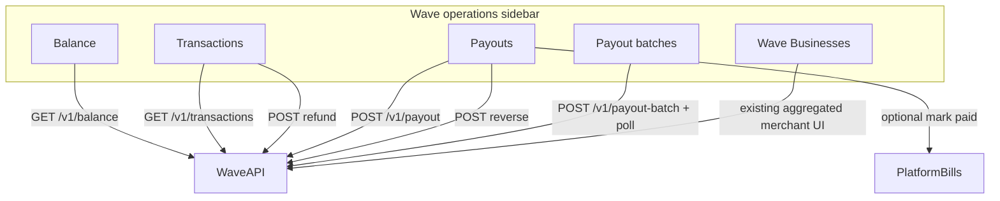

# Wave Operations (platform admin)

## Decisions (locked)

- **Payouts:** both freeform (pick `PlatformSupplier` + amount) and bill-based (APPROVED platform bills via Wave).
- **Scope:** full Wave surface from [`.cursor/plans/payout_balance.txt`](.cursor/plans/payout_balance.txt): balance, transactions + refund, single/bulk payouts, lookup, reverse, payout batches.
- **Nav:** new top-level **Wave operations** section; **move Wave Businesses** out of Businesses into this section.

## Information architecture

**Submenus / routes**

| Submenu | Path | Purpose |
|---------|------|---------|
| Balance | `/platform/wave-operations/balance` | Live wallet balance + refresh |
| Transactions | `/platform/wave-operations/transactions` | Day picker, cursor pagination, refund |
| Payouts | `/platform/wave-operations/payouts` | Single + bulk freeform; history/search; reverse; deep-link pay bills |
| Payout batches | `/platform/wave-operations/payout-batches` | Submit batch, poll status, per-row results |
| Wave Businesses | `/platform/wave-businesses` (unchanged URL) | Existing page, moved under this section only |

Also wire **Pay with Wave** into existing platform bills bulk-post flow ([`PlatformBillBulkPostModal`](webFrontend/src/components/platform/PlatformBillBulkPostModal.tsx) / [`platform-bill-bulk-pay.service.ts`](backend/src/services/platform-bill-bulk-pay.service.ts)).

## Backend

### 1. Extend Wave client

Add methods on [`WavePaymentService`](backend/src/services/wave-payment.service.ts) (same axios + `rethrowWaveAxiosError` + `WAVE_CHECKOUT_BEARER` via [`waveServiceFromEnv`](backend/src/services/wave-client-env.ts)):

- `getBalance()` → `GET /v1/balance`
- `listTransactions({ date, after? })` → `GET /v1/transactions`
- `refundTransaction(transactionId)` → `POST /v1/transactions/:id/refund`
- `createPayout(payload, idempotencyKey)` → `POST /v1/payout`
- `getPayout(id)` → `GET /v1/payout/:id`
- `searchPayouts({ client_reference })` → `GET /v1/payouts/search`
- `createPayoutBatch(payouts, idempotencyKey)` → `POST /v1/payout-batch`
- `getPayoutBatch(id)` → `GET /v1/payout-batch/:id`
- `reversePayout(id)` → `POST /v1/payout/:id/reverse`

Always send `idempotency-key` on mutating calls (UUID generated server-side and stored).

### 2. Persist audit trail

New Prisma models (platform-scoped, not merchant):

- `WaveOpsPayout` — Wave `pt-*` id, status, amount, fee, currency, mobile, name, `clientReference`, `idempotencyKey` (unique), optional `platformSupplierId`, optional `platformBillId`, `reversedAt`, raw error, timestamps
- `WaveOpsPayoutBatch` — Wave `pb-*` id, status, `idempotencyKey`, JSON summary / relation to child `WaveOpsPayout` rows

Currency rule: wallet currency comes from `GET /v1/balance`. Freeform payouts always use that currency. Bill-based Wave pay **rejects** bills whose `currency` ≠ wallet currency (clear preview error), matching Wave API constraints.

### 3. Platform API routes

Under `/api/platform/wave-operations/...` (platform owner/admin + new module permission):

- `GET /balance`
- `GET /transactions?date=&after=`
- `POST /transactions/:transactionId/refund`
- `POST /payouts` — body: `{ supplierId, receiveAmount, clientReference? }` (loads phone/name from `PlatformSupplier`)
- `POST /payouts/bulk` — body: `{ items: [{ supplierId, receiveAmount, clientReference? }] }` → creates Wave batch, persists batch + rows, returns batch id
- `GET /payouts` — local history (filter status / supplier / date)
- `GET /payouts/search?client_reference=` — proxy Wave search + upsert local
- `GET /payouts/:id` — local + optional Wave refresh
- `POST /payouts/:id/reverse`
- `GET /payout-batches/:id` — poll Wave, sync row statuses
- Bill path: extend [`platform-bill-bulk-pay.service.ts`](backend/src/services/platform-bill-bulk-pay.service.ts) so when gateway `checkoutAdapter === wave_gambia`, call `createPayout` / batch (phone from supplier), then `markPlatformBillPaid` with `paymentProviderRef = pt-*` (same APS success/ledger error-phase pattern)

Phone normalization: reuse/adapt existing mobile normalizer; require `PlatformSupplier.phone` on preview (same as APS).

### 4. RBAC

Add module slug `platform.wave_operations` in [`platform-modules.ts`](backend/src/config/platform-modules.ts) (+ seed label). Map FE permission keys in [`platformAdminRouteAccess.ts`](webFrontend/src/config/platformAdminRouteAccess.ts). Gate all new routes/pages on view/create/edit as appropriate (refund/reverse/payout = edit; balance/tx/list = view).

## Frontend

### 1. Navigation + sidebar

In [`navigation.ts`](webFrontend/src/config/navigation.ts):

- Add `APP_PATHS` for balance / transactions / payouts / payout-batches
- Add `PLATFORM_WAVE_OPERATIONS_SUBNAV` (Balance, Transactions, Payouts, Payout batches, Wave Businesses)
- **Remove** Wave Businesses from `PLATFORM_BUSINESSES_SUBNAV`
- Update `getPageTitle` / active-path helpers

In [`Sidebar.tsx`](webFrontend/src/layouts/Sidebar.tsx): new collapsible **Wave operations** section (same pattern as Finance/Corporate), localStorage open state, auto-open when path matches `/platform/wave-operations` or `/platform/wave-businesses`.

Wire routes in [`AppRoutes.tsx`](webFrontend/src/routes/AppRoutes.tsx).

### 2. Pages (UX)

Reuse existing platform table/modal patterns (e.g. billing transactions, bill bulk post)—clear hierarchy, confirmations on money movement, no cluttered hero chrome.

- **Balance:** large balance figure, currency, last synced, Refresh; empty/error states when bearer missing.
- **Transactions:** date control (default today), table (time, id, amount, fee, counterparty, reversal flag), “Load more” via `after` cursor, **Refund** with confirm modal (destructive).
- **Payouts:**
  - **Single:** `ContactSearchCombobox`-style supplier picker ([platform contacts](webFrontend/src/screens/PlatformContactsPage.tsx)), amount, optional client reference, confirm → sync result card (status/fee/id).
  - **Bulk:** multi-row editor (add suppliers + amounts) → preview eligibility (phone, amount > 0) → submit as Wave batch → redirect/poll batch detail.
  - **History:** local list + search by client reference; row → detail with Reverse (enabled only if within 3-day window and succeeded).
  - **Pay bills:** secondary CTA linking to `/platform/bills` with Wave available in bulk-post modal (adapter label “Wave”).
- **Payout batches:** list/detail with auto-poll every ~2s while `status !== complete`; per-payout succeeded/processing/failed + error message.
- **Wave Businesses:** no page rewrite; menu move only.

### 3. FE API client

New helpers in subscription/platform API module (same style as platform bill bulk APIs): typed fetch wrappers for all wave-operations endpoints.

## Bill-based Wave pay (reuse pattern)

Extend platform bulk post:

1. Preview already checks phone — keep.
2. Execute branch: if `aps_wallet` → existing APS; if `wave_gambia` → Wave single payout per bill (or one batch for the selection), then `markPlatformBillPaid`.
3. UI: update [`PlatformBillBulkPostModal`](webFrontend/src/components/platform/PlatformBillBulkPostModal.tsx) copy/error phases (`wave_send` alongside `aps_send`).

Freeform Wave Operations payouts do **not** auto-create bills; optional later link via `platformBillId` when paying from bills.

## Out of scope

- Merchant-tenant Wave payout UI (platform ops only this pass)
- Changing Wave Businesses provision logic
- Auto GL journal for freeform payouts (bill-based keeps existing mark-paid ledger; freeform is Wave wallet movement + audit table only unless you ask for GL later)
