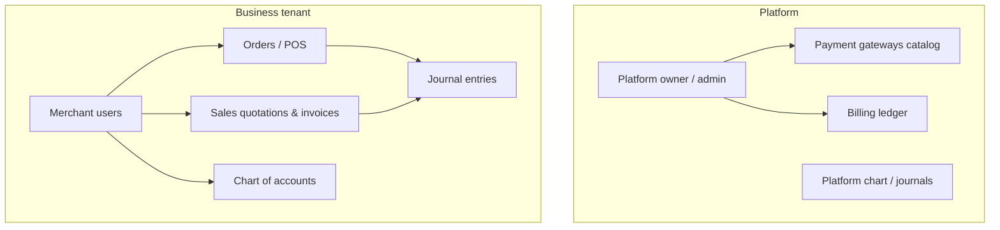

# EasyPay — system documentation

This folder contains **architecture**, **component**, and **workflow** documentation for the EasyPay monorepo (`backend/`, `webFrontend/`). It is intended for developers and operators. The repository root `README.md` (if present) remains the quick start; use these docs for deeper system behavior.

## How to read this documentation

| Document | Contents |
|----------|----------|
| [Architecture overview](./architecture-overview.md) | Stack, repository layout, runtime boundaries, high-level diagrams |
| [Backend components](./components-backend.md) | Express app, services map, middleware, public vs authenticated APIs |
| [Frontend components](./components-frontend.md) | React app, routing, navigation, API clients |
| [Data model](./components-data-model.md) | Prisma/PostgreSQL: tenants, users, billing, commerce, accounting |
| [Authentication & authorization](./workflows-authentication.md) | JWT, roles, entitlements, business context (`x-business-id`) |
| [Subscriptions & platform billing](./workflows-subscriptions-platform-billing.md) | Merchant plans, subscription invoices, platform ledger vs tenant |
| [POS, orders & payments](./workflows-merchant-pos-and-payments.md) | Orders, wallet/cash, receipts, customer sale ledger |
| [Sales documents & guest links](./workflows-sales-documents-and-guest.md) | Quotations, invoices, PDFs, public guest URLs, invoice wallet pay |
| [Restaurant](./workflows-restaurant.md) | Guest menu, table tokens, rate limits |
| [Accounting](./workflows-accounting.md) | Business chart of accounts, journals, GL and profit-and-loss reports |
| [Operations & environment](./operations-and-env.md) | Env vars, migrations, webhooks, deployment notes |
| [Platform administration](./platform-admin.md) | Platform owner UI, APIs, date filters (existing doc) |
| [7-aside internal partner integration](./INTEGRATION_7ASIDE.md) | Server-to-server API, webhooks, HMAC verification, log prefixes for booking app integration |
| [analytics-bi (biReports) integration](./INTEGRATION_ANALYTICS_BI.md) | Partner provision + Corporate subscription billing for biReports |
| [DirectPay biReports SQL pack](./DIRECTPAY_BIREPORTS_SQL_PACK.md) | Paste-ready Report Builder SQL (SaaS, commerce, merchant health) |

## Quick mental model

- **Platform** sells **subscriptions** to **businesses**; subscription money and platform GL live in **platform** accounting and **BillingLedger**.
- Each **business** is a tenant with its own **products**, **orders**, **contacts**, **sales documents**, and **merchant chart of accounts** / journals.
- **Customer payments** for orders or approved sales invoices use Merchant API gateway configuration. **Wave** uses the platform aggregator (`WAVE_CHECKOUT_BEARER`) plus a per-business aggregated merchant id; **Yonna/APS** use per-business encrypted credentials. Subscription billing uses separate platform env keys.
- **Public** routes (guest menu, guest quotation/invoice, public pay link) use **tokens in the URL** and no JWT.

## Diagram (tenancy)

