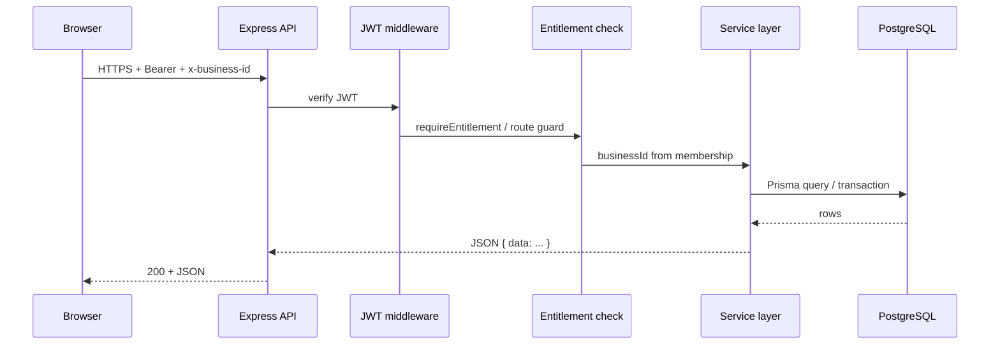

# Architecture overview

## Monorepo layout

| Path | Role |
|------|------|
| `backend/` | Node.js **Express** API, **Prisma** ORM, PostgreSQL |
| `webFrontend/` | **React** (Vite), **React Router**, Tailwind-style UI |
| `backend/prisma/` | Schema, migrations, seed |
| `docs/` | System documentation (this folder) |

## Technology stack

- **API:** Express, Zod validation on many routes, centralized error handling (`HttpError`).
- **Auth:** JWT in `Authorization: Bearer`; business scope via `x-business-id` header for tenant routes.
- **Data:** PostgreSQL; Prisma Client for queries and transactions.
- **Email:** Resend (e.g. staff invites, subscription PDFs, sales quotation/invoice notifications) when configured.
- **Payments:** Pluggable **PaymentGateway** rows; Wave Gambia and Yonna Wallet adapters for merchant checkout; separate flows for **subscription** invoice checkout vs **order/sales-invoice** checkout.

## Request flow (authenticated merchant)

## Request flow (public / guest)

- No JWT. Identifiers are **public tokens** (e.g. dining table token, payment `publicToken`, sales **guestToken** on quotation/invoice).
- Rate limiting applies to selected public endpoints (e.g. restaurant guest orders).

## Service layer pattern

- **`backend/src/app.ts`** registers routes and delegates to **`backend/src/services/*.service.ts`**.
- Heavy business logic stays in services; route handlers parse params/body and format responses.
- Cross-cutting: **`backend/src/lib/`** (prisma client, errors), **`backend/src/middleware/`**, **`backend/src/config/`**.

## Frontend pattern

- **`webFrontend/src/routes/AppRoutes.tsx`** defines public vs protected routes.
- **`ProtectedRoute`** checks role and **permission keys** (entitlements).
- API calls go through **`webFrontend/src/services/`** (e.g. `salesApi.ts`, `subscriptionApi.ts`) with base URL from **`webFrontend/src/config/api`**.

## Two billing worlds (do not confuse)

1. **Platform ↔ business (subscription):** `Subscription`, `SubscriptionInvoice`, `BillingLedgerEntry`, platform Wave/Yonna webhooks for **subscription** checkout — pays EasyPay for the plan.
2. **Business ↔ end customer (commerce):** `Order`, `Payment`, `Receipt`, **sales invoices**, merchant wallet credentials — pays the **merchant** for goods/services.

These use different credential stores and different GL namespaces (business vs platform).
